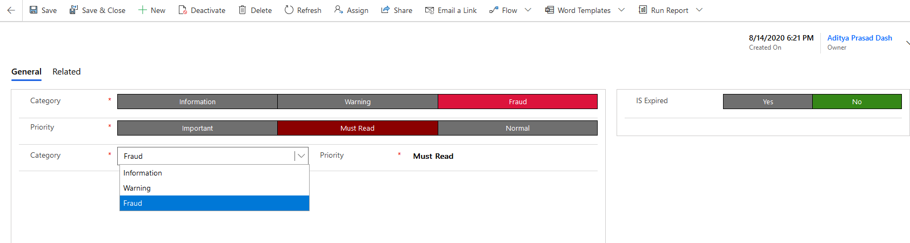
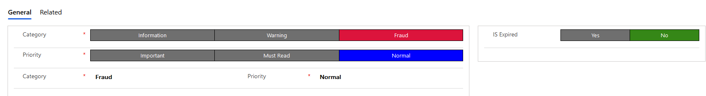
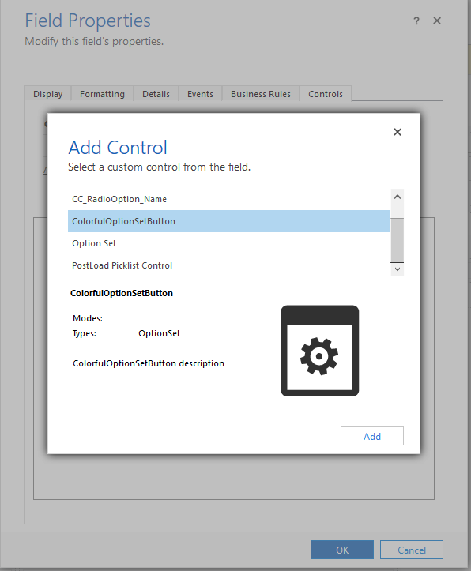
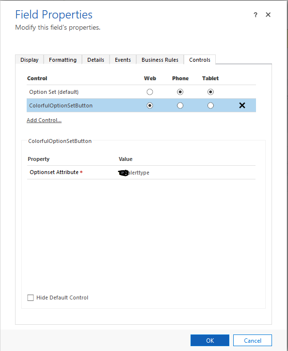
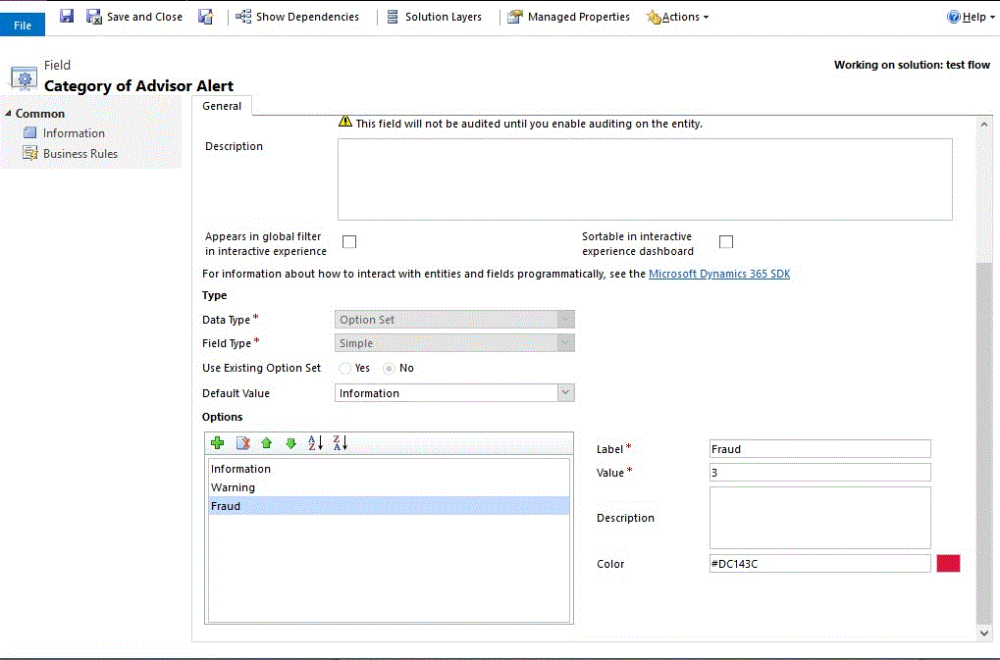

# pcfcolorfuloptionsetcontrol

## Control Overview
This control is an OptionSet control for model driven app (D365), which will display all options as clickable buttons with colorful background set for the options inside OptionSet. It is best works for alert types or Yes No optionsets with color coding. This control dynamically sets the buttons based on options in optionset.

## Install
 - Download the latest version of the solution from solution folder 
 - Import the solution to your Dynamics 365 instance

## Control Registration Steps 
 - After import of the control the control is available in the list of available controls

## OptionSet Color Configuration
To set the color of the optionset buttons configure the color in optionset attribute

